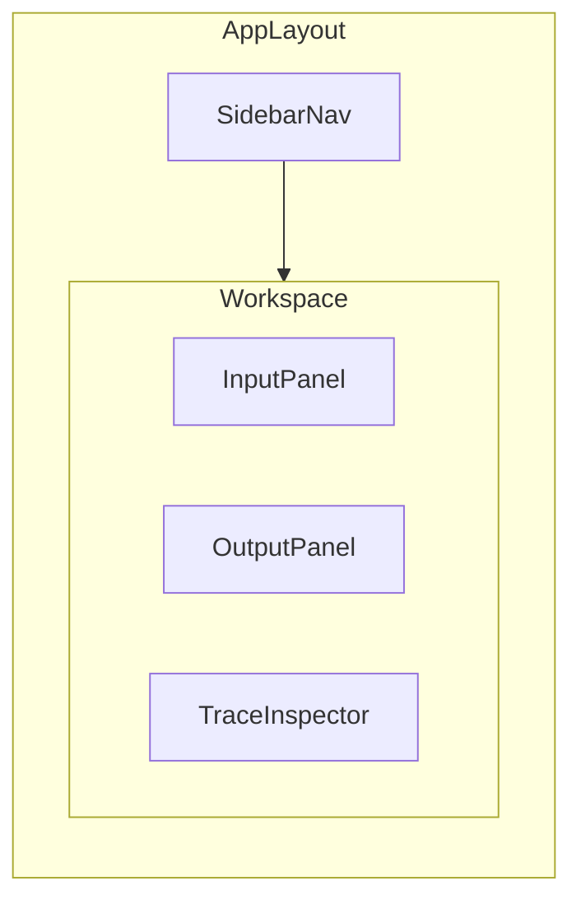

# Callister Studio — Roadmap

Callister Studio is an open-source desktop workbench for **debugging, testing, visualizing, and learning** AI workflows. It helps you run a request, watch each step unfold, inspect raw payloads, and compare results across providers — across ASR, NLP, TTS, LLM, Agent, OCR, and CV.

**What it is:** a local desktop tool that makes AI pipelines observable.

**What it is not:** a production inference server, a chat-only client, or a model-training platform.

**Architecture:** [ARCHITECTURE.md](ARCHITECTURE.md)  
**Contributing:** [CONTRIBUTING.md](CONTRIBUTING.md)

## UI layout (target)



**Conventions:**

- **Left sidebar:** module icons (Home, ASR, TTS, LLM, Agent, OCR, CV, NLP, Pipelines, Settings)
- **Main workspace:** split panes — input (left/top), output (right/bottom)
- **Trace inspector** (bottom panel): latency, tokens, headers, raw JSON, step timeline
- **Top bar / provider area:** active provider selector, run/stop, export session
- **Theme:** light/dark/system via CSS variables

## Tech stack (target)

| Layer       | Choice                                         |
| ----------- | ---------------------------------------------- |
| Desktop     | Electron 33+                                   |
| Build       | electron-vite + TypeScript                     |
| UI          | React 18 + Tailwind + shadcn/ui                |
| State       | Zustand + TanStack Query                       |
| Persistence | better-sqlite3 (main) + electron-store (prefs) |
| Packaging   | electron-builder                               |
| Monorepo    | pnpm workspaces + Turborepo                    |

## Milestones

| Version    | Scope                                                        |
| ---------- | ------------------------------------------------------------ |
| **v0.1.0** | Phase 0 + 1 + 2 — app shell, LLM playground, trace inspector |
| **v0.2.0** | ASR + TTS + one pipeline preset                              |
| **v1.0.0** | Core modules stable, pipeline composer, plugin API           |

## Build order

```
Phase 0 (Tooling)
  → Phase 1 (Shell)
    → Phase 2 (LLM) ──→ Phase 6 (Agent)
    → Phase 3 (ASR)  ─┐
    → Phase 4 (TTS)  ─┼→ Phase 9 (Pipelines)
    → Phase 5 (NLP)  ─┤
    → Phase 7 (OCR)  ─┤
    → Phase 8 (CV)   ─┘
      → Phase 10 (Extensions) → Phase 11 (Release)
```

---

## Phase 0 — Repository & Tooling Foundation

- [x] Add root `README.md` and `README.zh-CN.md`
- [x] Write `docs/CONTRIBUTING.md` and `docs/ARCHITECTURE.md` (brief)
- [x] Write `docs/ROADMAP.md` (this file)
- [x] Initialize pnpm monorepo (`apps/desktop`, `packages/ui`, `packages/core`, `packages/providers`, `packages/trace`)
- [x] Configure TypeScript project references, ESLint, Prettier
- [x] Scaffold Electron app with electron-vite (main / preload / renderer)
- [x] Add `electron-builder` config for Win / macOS / Linux
- [x] Set up GitHub Actions: lint, typecheck, build smoke test

---

## Phase 1 — App Shell & Shared Infrastructure

- [x] **Layout shell:** `AppLayout` with sidebar, workspace, status bar
- [x] **Routing:** React Router — `/`, `/asr`, `/tts`, `/llm`, `/agent`, `/ocr`, `/cv`, `/nlp`, `/pipelines`, `/settings`
- [x] **Theme system:** light / dark / system; persist preference
- [x] **Settings page:** provider list, API base URLs, default models
- [x] **Secure credential vault** (main process): encrypt API keys at rest (`safeStorage` + `electron-store`)
- [x] **`@callister/ui`:** Button, SplitPane, CodeBlock, JsonViewer, Input, Select, TextArea, Panel, AudioPlayer, Waveform
- [x] **`@callister/trace`:** `TraceSession`, step recorder, export JSON
- [x] **IPC layer:** typed channels for `provider.invoke` (LLM stream), `fixture` import/export, settings, credentials
- [x] **Home / Launchpad:** module cards with provider configured status

---

## Phase 2 — Provider Framework & LLM Playground

- [x] **`ProviderRegistry`** in `packages/providers`
- [x] Adapters: OpenAI-compatible, Anthropic, Ollama (local)
- [x] LLM playground UI:
  - [x] System + user prompt editors
  - [x] Model / temperature / max tokens controls
  - [x] Streaming response with token counter (estimated)
  - [x] Raw request/response tab in trace inspector
  - [x] Latency breakdown (TTFB, total, tokens/sec)
- [x] Session history: save / replay / delete conversations
- [x] Export session as JSON fixture
- [x] Error surface: rate limits, auth failures, retry button

---

## Phase 3 — ASR Playground

- [x] Audio input: file upload (wav / mp3 / m4a), microphone record, drag-and-drop
- [x] Waveform visualization + playback scrubber
- [x] Providers: OpenAI Whisper API, faster-whisper (local via subprocess)
- [x] Providers: iFlytek short speech (WebSocket IAT) and long speech (REST LFASR)
- [x] Provider card navigation with per-vendor debug panels and API doc links
- [x] iFlytek: credential inputs, short/long mode toggle, SDK code snippet generation
- [x] Output: transcript, word / segment timestamps, confidence (when available)
- [x] Overlay timestamps on waveform
- [x] Compare two ASR runs side-by-side (diff view)
- [x] Batch mode: single-file batch runs with status + export via fixture
- [ ] Batch mode: folder of audio files → CSV / JSON export
- [ ] Google STT provider (optional)

---

## Phase 4 — TTS Playground

- [ ] Text input with SSML toggle (where supported)
- [ ] Providers: OpenAI TTS, Edge TTS (free), Piper (local), Coqui (optional)
- [ ] Voice / speed / format controls
- [ ] Audio output player + download
- [ ] Latency metrics (time-to-first-byte, total synthesis time)
- [ ] A/B voice comparison for same text

---

## Phase 5 — NLP Toolkit

Focused on inspection and learning, not production NLP pipelines.

- [ ] **Tokenization lab:** BPE / WordPiece visualizer, token IDs, offsets
- [ ] **Embeddings explorer:** input text → vector preview (PCA / t-SNE 2D plot for small batches)
- [ ] **Classification / NER demo:** run spaCy or HuggingFace pipeline, highlight entities
- [ ] **Similarity calculator:** cosine similarity between two texts
- [ ] Provider hooks: OpenAI embeddings, local `sentence-transformers` (subprocess)

---

## Phase 6 — Agent Workbench

- [ ] Multi-step agent loop visualizer (plan → tool call → observation → repeat)
- [ ] Tool registry: define tools with JSON Schema params
- [ ] Built-in tools: `web_fetch`, `calculator`, `read_file` (sandboxed)
- [ ] **MCP client** (stretch): connect external MCP servers for tool integration
- [ ] Step timeline with expandable tool I/O
- [ ] Human-in-the-loop: approve tool calls before execution
- [ ] Export agent trace as markdown report

---

## Phase 7 — OCR Playground

- [ ] Image input: upload, paste, drag-and-drop
- [ ] Providers: Tesseract (local), PaddleOCR, cloud OCR APIs
- [ ] Output: extracted text + bounding boxes drawn on image
- [ ] Confidence heatmap overlay (when available)
- [ ] Table / layout mode toggle (plain text vs structured blocks)
- [ ] Batch folder processing

---

## Phase 8 — CV Playground

- [ ] Image / video frame input
- [ ] Tasks: classification, object detection, segmentation (pick 1–2 first)
- [ ] Providers: ONNX Runtime local models, HuggingFace Inference, cloud vision APIs
- [ ] Overlay bounding boxes, labels, confidence scores
- [ ] Model metadata panel (input size, classes, preprocessing steps)
- [ ] Webcam live preview (optional, Phase 8b)

---

## Phase 9 — Pipeline Composer

Chain modules into reproducible pipelines.

- [ ] Visual DAG editor: nodes = ASR → LLM → TTS, etc.
- [ ] Data flow typing between nodes (audio → text → audio)
- [ ] Run pipeline with full end-to-end trace
- [ ] Save / load pipeline definitions (JSON)
- [ ] Preset templates: `VoiceAssistant`, `ImageDescribe`, `DocumentQA`
- [ ] Step-through debugger (pause between nodes)

---

## Phase 10 — Developer Experience & Extensibility

- [ ] **Plugin API:** third-party modules register via manifest (`callister.plugin.json`)
- [ ] **Mock mode:** stub providers for offline UI dev
- [ ] **Fixture library:** import / export shared test cases (community presets)
- [ ] CLI companion (optional): `callister run fixture.json --provider ollama`
- [ ] Telemetry opt-in: anonymous crash reports (Sentry)
- [ ] i18n scaffold (en first; zh-CN later)

---

## Phase 11 — Polish, Docs & Release

- [ ] Onboarding wizard: add first API key, pick default providers
- [ ] In-app docs panel per module (what is ASR, how to interpret traces)
- [ ] Keyboard shortcuts cheat sheet
- [ ] Auto-update (electron-updater)
- [ ] Signed releases for macOS / Windows
- [ ] Demo video + screenshot gallery in README
- [ ] v0.1.0 release checklist

---

## Out of scope for v1

- Mobile apps (iOS / Android)
- Cloud sync or multi-device session sharing
- Team collaboration / shared workspaces
- Model training or fine-tuning
- Production-grade inference serving

---

## Optional later

- `docs/ROADMAP.zh-CN.md` — Chinese roadmap translation
- Pre-built release downloads in README
- Short GIF demo of LLM trace inspector
